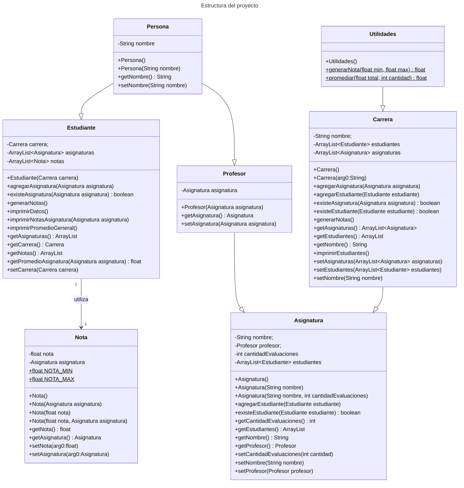

# Instrucciones

1. Asuma un curso de 5 estudiantes, escriba un método que genere notas al azar, y las asigne a cada estudiante para una de sus asignaturas.

2. Escriba un método que promedie las notas de cada estudiante, para esta asignatura.

3. Escriba un método que muestre el detalle de las notas de los estudiantes, y su promedio. Considere que cada método debe ser correctamente identificado con la Clase que lo debe desplegar, y que la herencia es un elemento a evaluar.

> Salida del programa, usando utilidades para generar y promediar notas:

```
---------------------------------------------
Carrera: Informatica
Cantidad de estudiantes: 5
---------------------------------------------
Estudiante: Jaime
Promedio General: 3.3
Asignatura(s):
  + Programación Avanzada
    - Notas: [ 4.9 | 2.9 | 2.6 | 2.5 | 2.4 ]
    - Promedio: 3.1
  + Matemática
    - Notas: [ 3.2 | 3.3 | 4.3 ]
    - Promedio: 3.6
---------------------------------------------
Estudiante: Matias
Promedio General: 3.1
Asignatura(s):
  + Programación Avanzada
    - Notas: [ 6.2 | 3.2 | 1.4 | 3.0 | 5.5 ]
    - Promedio: 3.9
  + Matemática
    - Notas: [ 2.4 | 2.1 | 2.4 ]
    - Promedio: 2.3
---------------------------------------------
Estudiante: Daniel
Promedio General: 4.6
Asignatura(s):
  + Programación Avanzada
    - Notas: [ 1.2 | 5.5 | 5.9 | 6.4 | 1.6 ]
    - Promedio: 4.1
  + Matemática
    - Notas: [ 4.9 | 6.6 | 3.8 ]
    - Promedio: 5.1
---------------------------------------------
Estudiante: Claudia
Promedio General: 3.6
Asignatura(s):
  + Programación Avanzada
    - Notas: [ 2.1 | 4.8 | 5.7 | 4.7 | 3.7 ]
    - Promedio: 4.2
  + Matemática
    - Notas: [ 1.8 | 5.1 | 2.1 ]
    - Promedio: 3.0
---------------------------------------------
Estudiante: Carolina
Promedio General: 3.8
Asignatura(s):
  + Programación Avanzada
    - Notas: [ 3.3 | 6.8 | 5.3 | 2.5 | 3.2 ]
    - Promedio: 4.2
  + Matemática
    - Notas: [ 3.4 | 4.8 | 2.3 ]
    - Promedio: 3.5
```

### UML Proyecto:

**Simbolo** | **Definición**
:-:|:-:
`-` | privado
`+` | publico
`$` | estatico


